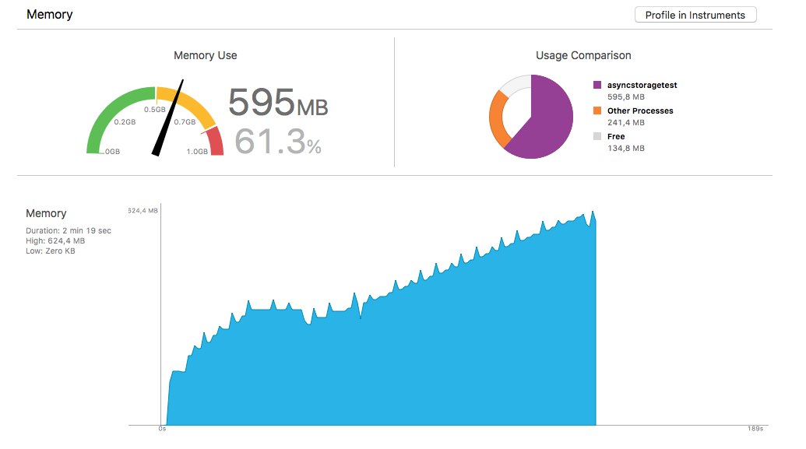

Sample project demonstrating React Native app increasing its memory usage when
periodically saving long string via `AsyncStorage.setItem`, eventually getting
killed by system, because it hits the limits.

The app gets killed only when running on device, when running in simulator the
memory gets freed periodically as seen on XCode's memory usage screenshots
below. Device used: iPad Mini 2 ME800SL/A with iOS 11.0.3. Simulator used:
iPad Pro (9.7-inch) with iOS 11.0.1.

Project is ejected `create-react-native-app` with react-native updated to
latest version 0.49.3.

`App.js` code to reproduce:

```js
import React from 'react';
import { AsyncStorage, Text, View } from 'react-native';

const FIXED_STRING_LENGTH = 150 * 1000 * 1000
const SAVE_STRING_LENGTH = 10 * 1000 * 1000

export default class App extends React.Component {
	constructor(props) {
		super(props)

		this.fixedString = 'a'.repeat(FIXED_STRING_LENGTH)
	}

  componentDidMount() {
    setTimeout(this.saveString, 5000)
  }

  saveString = () => {
    AsyncStorage.setItem('foo', 'a'.repeat(SAVE_STRING_LENGTH)).then(() => {
      setTimeout(this.saveString, 2000)
    })
  }

  render() {
    return (
      <View style={{ flex: 1, alignItems: 'center', justifyContent: 'center' }}>
        <Text>
					This app saves long string via AsyncStorage.setItem every 2 seconds,
					gradually increases its memory usage and eventually gets killed by
					iOS because it wants too much memory when running on device
					(iPad Mini 2 ME800SL/A).
				</Text>
      </View>
    );
  }
}
```

XCode memory usage when running on device (iPad Mini 2 ME800SL/A with iOS
11.0.3), just seconds before it gets killed by system:



XCode memory usage when running in simulator (iPad Pro (9.7-inch) with iOS
11.0.1):


```
$ react-native info

Environment:
  OS:  macOS High Sierra 10.13
  Node:  8.8.1
  Yarn:  1.2.1
  npm:  5.4.2
  Watchman:  4.9.0
  Xcode:  Xcode 9.0.1 Build version 9A1004
  Android Studio:  Not Found

Packages: (wanted => installed)
  react: 16.0.0 => 16.0.0
  react-native: 0.49.3 => 0.49.3
```
